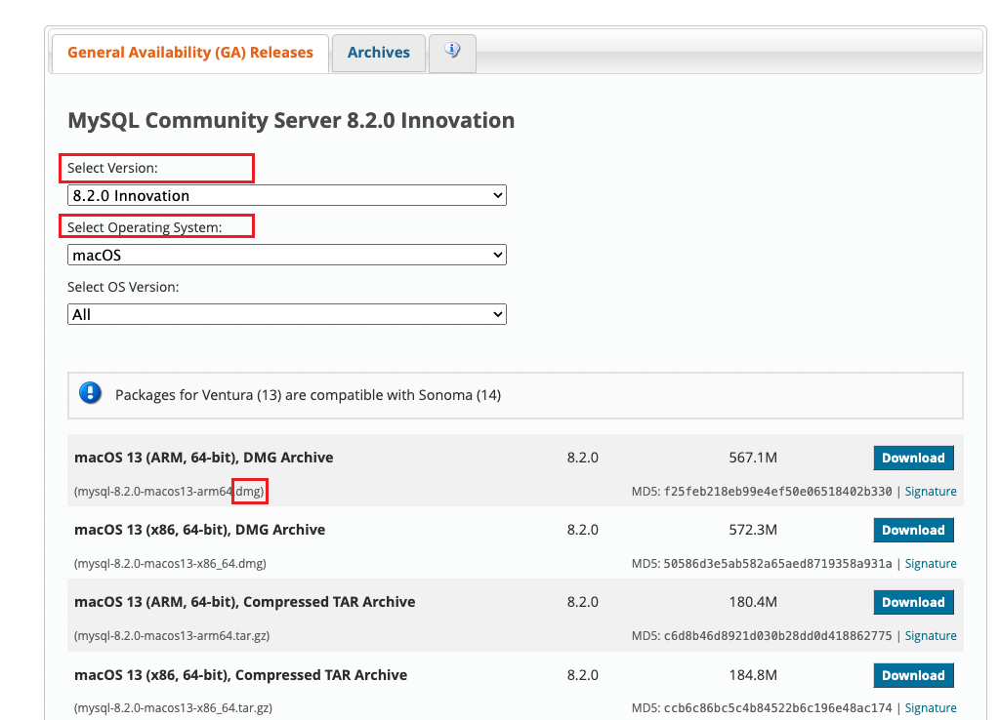

## 数据库介绍

数据库是一个用于存储、检索、管理和处理数据的系统。它们是信息管理的关键组件，在许多应用程序和组织中发挥着核心作用。数据库允许用户高效效地组织、存储和查询大量信息。

### 基本概念

1. **数据的组织和存储**：数据库通过表格式的形式存储数据，表格中的每一行代表一个数据项，每一列代表该数据项的一个属性。
2. **数据管理系统（DBMS）**：数据库通常通过一个数据库管理系统进行管理。DBMS 是一种软件，它提供了创建、管理和操作数据库的工具和功能
3. **数据完整性和安全性**：数据库设计时会考虑数据的完整性（确保数据的准确性和一致性）和安全性（保护数据免受未授权访问和损坏）

### 发展历史

1. **早期文件系统**：在数据库出现之前，数据存储在文件系统中，每个应用程序都需要单独的文件处理程序来读写数据，这种方式效率低下，且数据共享和集成困难。
2. **层次式和网状数据库**：随着计算机技术的发展，出现了层次式和网状数据库系统。它们提供了比文件系统更复杂的数据组织方式，但数据的物理结构和应用程序紧密耦合，灵活性有限。
3. **关系型数据库**：这种模型用表格的形式来组织了数据，并通过 SQL（结构化查询语言）进行操作，大大提高了灵活性和易用性。
4. **对象数据库和NoSQL**：随着面向对象编程的普及，对象数据库（ObjectStroe和 Versant）出现。同时，为了应对大数据和高扩展性的需求，NoSQL 数据库（如 MongDB, Cassandra）也开始兴起
5. **云数据和大数据**：云计算的兴起带来了基于云的数据库服务（如 Amazon RDS, Google Cloud SQL，腾讯云，阿里云等），同时大数据技术（如 Hadoop， Spark）也影响了数据库技术的发展。

### 数据库类型
1. **关系型数据库**：这是最常见的数据库类型，如 MySQL PostgreSQL SQLite 和 Oracle。它们使用表来存储数据，这些表通过关系（例如，外键）相互连接。
2. **非关系型数据库**：又称为 NoSQL 数据库，如 MongoDB\Cassandra 和 Redis 。这类数据库不使用传统的表格模型，而是采用文档，键值对、图或列存储数据。
3. 对象数据库：这种数据库将数据作为对象存储，与面向对象编程语言中的对象类型

### MySQL数据库

MySQL 是一个开源的关系型数据库管理系统（RDBMS），使用结构化查询语言（SQL）进行数据管理。它是由瑞典的 MySQL AB 公司开发的，后来被 Sun Microsystems 收购，Sun 随后又被甲骨文公司（ Oracle Corporation）收购。作为世界上最流行的开源数据库之一，MySQL 在小型到大型的应用程序中都得到了广泛的使用，尤其是在与Web应用结合时。

## MySql 安装和连接

当前文档基于 MySQL8.x 进行编写，它的安装其实非常简单，只需几个关键步骤

### 下载 MySQL

1. **访问官方网站**：前往 MySQL 的官方网站 [下载MySQL](https://dev.mysql.com/downloads/mysql/ "MySQL 官网")
2. **选择版本**：基于我们的操作系统，选择对应系统的版本
3. **选择安装包类型**：依据我们的操作系统选择合适的安装包类型（如 windows 上的 MSI 安装程序，Linux 上的 RPM 包， mac 上的 DMG）
4. **下载**：下载相应版本的安装文件，对于个人使用，我们可以选择 `Community` 版本，这是一个免费开源的版本。


### 安装 MySQL

1. windows 安装
   1. 运行下载的 MSI 文件
   2. 按照安装向导步骤操作，选择所需的配置选项，如安装路径、配置类型（开发者、服务器、客户端）等。
   3. 设置 root 用户密码，并记住它，因为后续需要用到
   4. 配置 MySQL 服务，包括是否在系统启动时自动运行（可选）

2. Linux 安装
   1. 对于使用 RPM 包的 Linux 发行版（如 Red Hat、Fedora、CentOS），使用 `rpm` 命令安装。
   2. 对于 Debian或 Ubuntu，可能需要使用 `dpkg` 命令或通过添加 MySQL 仓库后使用 `apt-get` 安装。
   3. 安装过程中需要设置 root 用户名密码
   4. 启动 MySQL 服务，并确保它在启动时自动运行

3. macOS 安装
   1. 运行下载的 DMG 文件
   2. 遵循安装向导进行安装
   3. 设置 root 用户密码，并启动 MySQL 服务

### 命令行连接

在命令行（或终端）中连接到 MySQL 数据库，通常使用 MySQL客户端工具。但是在实际生产环境中，我们一般采用 GUI 可视化工具。

**01 基本命令**

```shell
  mysql -u [username] -p[password] -h [hostname] -P [port]
```

**说明**

1. `-u [username]` mysql 的用户名
2. `-p [password]` mysql 的密码，注意 -p 和密码之间没有空格。如果省略密码，系统在执行命令后会提示我们输入
3. `-h [hostname]` mysql 服务器的主机名，如果 mysql 服务器运行在本地机器上，可以使用 localhost ，或省略该选项
4. `-p [port]` mysql 服务器监听的端口号，如果是默认端口（3306），可以省略该选项

**示例**

假设我们的用户名是 `root` ，密码是 `123456`，mysql 服务器运行在本地机器上，使用默认端口，则连接命令为：

```bash
mysql -u root -p 123456
mysql -u root -p 然后依据提示输入密码
```

**02 注意事项**

1. 确保在运行 mysql 客户端之前， MySQL 服务已经启动
2. 在生产环境中，为了安全起见，避免在命令行中直接包含密码，最好在提示时输入

### GUI连接

MySQL 数据库的图形用户界面（GUI）工具提供了一种直观和友好的方式来管理数据库，执行查询，以及进行数据库设计和优化。

**01 MySQL Workbench**

它是 MySQL 官方提供的一个强大的可视化工具，它提供了数据库设计，sql 开发，数据库管理和服务器配置等功能。通过它的 EER(增强实体-关系)图功能，用户可以非常直观地设计和修入数据库结构

**02 Navicat for MySQL**

它是一个商业的数据库管理工具，提供跨平台支持（windows macos linux）。它具有丰富的功能，如数据库设计、数据同步、备份、导入、导出等功能，适用于专业开发人员和新手。推荐购买正版使用

## 初识 SQL 语句

### 认识 SQL 语句

SQL(Structured Query Language) 是一种专门用于管理和操作关系型数据库的编程语言，它允许用户创建、修改、管理和检索数据库中存储的数据。 SQL 的设计目录是提供一种简单有效的方式来读写复杂的数据结构。

1. **标准化**：SQL 是一种标准化的语言，被广泛应用于各种数据库系统中，如 MySQL, SQL Server，Oracle 等。
2. **声明性**：与过程性编译语言不同，SQL 是声明性的。用户只需要指定要完成的任务（例如检索和更新数据），而不是需要提供具体的步骤或方法来完成这些任务。
3. **多功能性**：SQL 可以用来执行各种数据操作，包括数据查询、数据更新（插入、修改、删除）数据库和表的创建和修改，以及数据访问控制。

### SQL 语句分类

**01 数据定义语句（DDL）**
- 用途：用于定义和修改数据库(表)结构
- 关键字：`CREATE` `ALTER` `DROP`
- 示例：`CREATE TABLE users (id INT, name VARCHAR(50))`
- 说明：DDL 用于创建新的数据库、表、视图等，或者修改现有数据库结构的布局。`CREATE` 用于创建新结构， `ALTER` 用于修改现有结构，`DROP` 用于删除结构。

**02 数据操作语句（DML）**
- 用途：用于在数据库中插入、更新、删除数据
- 关键字：`INSERT` `UPDATE` `DELETE`
- 示例：`INSERT INTO users (id, name) values(1, 'syy')`
- 说明：DML 用于管理数据库中的表的数据，`INSERT` 用于添加新的记录， `UPDATE` 用于更新现有记录，`DELETE` 用于删除记录

**03 数据查询语句（DQL）**
- 用途：用于查询数据库中表的数据
- 关键键：`SELECT`
- 示例：`SELECT name, age FROM users WHERE age>18`
- 说明：此类 SQL 用于从数据库的表中查询数据，可以使用各种条件来过滤数据，选择特定列，以及对结果进行排序和分组

**04 数据控制句语（DCL）**
- 用途：用于管理数据库的权限和安全
- 关键字：`GRANT` `REVOKE`
- 示例：`GRANT SELECT ON database.tabale TO user`
- 说明：DCL 涉及到数据库的安全性和用户权限，`GRANT` 用于授权，而 `REVOKE` 用于撤权


## 数据库操作（DDL）

上文提到过 DDL 语句的用途就是用来控制数据库、数据表的增、删、改操作。这里就归纳一些生产过程中可能会用到的数据库操.

### 创建数据库

在创建数据库的时候，如果数据已经存在，标准的 `CREATE DATABASE` 语句会导致语法错误。为了避免这种情况，我们可以使用 `IF NOT EXISTS` 选项，这样的话，如果数据库已经存在，SQL 命令就不会执行任何操作，也不会显示报错。

```shell
# 创建一个数据库，如果它不存在的话
CREATE DATABASE IF NOT EXISTS database_name
```

**说明**
- `IF NOT EXISTS` 这是一个条件判断，用于检查指定的数据库名称是否已存在，如果数据库不存在，那么就会创建一个新的数据库；如果已经存在，那么 SQL 命令不会执行任何操作，也不会引发错误。
- `database_name` 是我们要创建的数据库名称。名称应该遵循数据库系统的命名规则，例如：不包含特殊字符、不与保留字冲突等

**注意**
- `命名规则`：选择的数据库名称应该符合特定的规则和限制，例如：避免使用空格、特殊字符或关键字。
- `字符集和排序规则`：在创建数据库时，我们可以指定字符集和排序规则。

```shell
CREATE DATABASE IF NOT EXISTS mydatabase
CHARACTER SET utf8mb4
COLLATE utf8mb4_unicode_ci
```

这里指定了字符集为 `utf8mb4` 和对应的排序规则 `utf8mb4_unicode_ci`

### 删除数据库

删除数据库是一个重要操作，一旦执行，所有存储在数据库中的数据将被永久删除。

```shell
DROP DATABASE IF EXISTS database_name
DROP DATABASE IF EXISTS mydatabase
```

**注意**
- `IF EXISTS` 这个条件用于检查指定的数据库是否存在，如果数据库存在，则执行删除操作；如果不存在，则不执行任何操作，避免了错误。
- `操作前备份`：在执行删除操作之前，请确保已备份所有重要数据。

### 修改数据库

修改数据库通常涉及更改其配置或参数。这类操作依赖于具体的数据库系统和设置，但是修改数据的操作在实际生产时，并不常见，因为在设计之初这些信息都应制定完善。

**示例**

在 MySQL 中，修改数据库的字符集和排序规则

```shell
ALTER DATABASE database_name
CHARACTER SET = utf8mb4
COLLATE=utf8mb4_unicode_ci
```

**注意**
- 修改数据库属性可能会影响存储在其中的数据，应该谨慎操作
- 一些修改可能需要数据库重启才能生效

### 使用某个数据库

在执行针对特定数据库的操作之间，需要先选择（使用）这个数据库

```bash
  USE database_name
```

**注意**
- 在多用户、多数据库的环境中，确保选择了正确的数据库，避免在错误的数据库上执行操作

### 查看数据库

查看数据库服务器上所有数据库的列表

```bash
  SHOW DATABASE;
```

**注意**
- 这个命令列出所有数据库，但我们可能只能够访问其中一部分，这取决于我们的用户权限

我们还可以获取特定数据库的详细信息，如表结构、大小等。

**示例**

```bash
  SHOW CREATE DATABASE datatabase_name
  SHOW TABLES FROM database_name
  DESCRIBE database_name.table_name
```

**注意**
- 获取数据库信息的方法和可用命令会依据具体的数据库系统而有所不同

## 数据表操作（DDL）

### 创建数据表

创建新表就是在数据库中定义新数据结构的过程

**语法**

```bash
  CREATE TABLE table_name(
    column1 datatype constraint,
    column2 datatype constraint,
    ......
  )
```

**示例**

```bash
  CREATE TABLE students (
    id INT AUTO_INCREMNT PRIMARY KEY,
    name VARCHAR(100) NOT NULL,
    enrollement_data DATE
  )
```

**注意**
- 每个列(column) 必须有一个数据类型
- 可以为列添加约束，如 `NOT NULL` (非空)、`PRIMARY_KEY`(主键)等。

### 删除数据表

删除表将移除表及其所有数据

**语法**

```bash
  DROP TABLE IF EXISTS table_name;
```

**示例**

```bash
  DROP TABLE IF EXISTS students;
```

**注意**
- `IF EXISTS` 防止在表不存在时出现语法错误
- 此操作不可逆，所有数据将被永久删除

### 修改表结构

修改表结构可以添加、删除或更改列

**添加列**

```bash
  # ADD 新字段 字段类型
  ALTER TABLE table_name ADD column_name datatype;
  # 示例
  ALTER TABLE students ADD birth_date DATE;
```

**删除列**

```bash
  # 关键字 DROP COLUMN 字段名
  ALTER TABLE table_name DROP COLUMN column_name
  # 示例
  ALTER TABLE sudents DROP COLUMN brith_date
```

**更改列**

```bash
  # MODIFY COLUMN 字段名 字段类型
  ALTER TABLE table_name MODIFY COLUMN column_name new_type;
  # 示例
  ALTER TABLE students MODIFY COLUMN name VARCHAR(255)
```

**更改表名**

```bash
  # 关键字 RENAME TO 新表名
  ALTER TABLE table_name RENAME TO new_table_name;
  # 示例
  ALTER TABLE students RENAME TO student_info;
```

**注意**
- 修改表结构可能会影响现有数据
- 在进行结构更改之前，请确保已备份表
- 修改表名是一个立即执行的操作，一旦更改，原始的表名将不再生效
- 在不同的数据库系统中，修改表名可能使用 `RENAME TABLE table_name TO new_table_name`

### 查询表信息

查询数据库中现有表的信息，如表结构

**语法**

```bash
  SHOW TABLES; # 查询所有的 table 列表
  DESCRIBE table_name; # 查询表的创建语句
```

**示例**

```bash
  SHOW TABLES;
  DESCRIBE sutdents;
```

**注意**
- 这些命令对于了解数据库中的表和表结构非常有用。
- `DESCRIBE` 提供了关于表中列的详细信息，如数据类型、是否允许空值等。

## 数据类型

MySQL 支持多种数据类型，允许我们依据数据的性质和要求选择最合适的类型。了解这些类型及其语法细节对于设计有效的数据库表结构至关重要。

### 整型类型

整型数据用于存储整数值。MySQL 提供了多种整型数据类型，以适应不同大小的数值范围。

**01 TINYINT**
- 存储范围：-128 到 127 （有符号），0 到 255 （无符号）
- 用途：用于存储小一些的整数值
- 示例：`age TINYINT UNSIGNED`

**02 SMALLINT**
- 存储范围：-32768到32767（有符号），0到65535（无符号）
- 用途：用于存储稍大一点的整数值
- 示例：`year SMALLINT`

**03 MEDIUMINT**
- 存储范围：-8388608 至 8388607 （有符号）， 0 至 16777215（无符号）
- 用途：用于存储中等大小的数值
- 示例：`population MEDIUMINT`

**04 INT 或 INTEGER**
- 存储范围：-2147483648至2147483647（有符号），0至4294967295(无符号)
- 用途：常用的整数类型，适用于大多数需求
- 示例：`user_id INT`

**05 BIGINT**
- 存储范围：-9223372036854775808 到 9223372036854775807（有符号），0 到 18446744073709551615（无符号）
- 用途：用于存储非常大的整数类型值
- 示例：`national_debt BIGINT`

**语法细节**
- 有符号与无符号：可以通过在类型后添加 `UNSIGNED` 关键字来定义无符号整数。无符号整数只能是正数或零，而有符号整数可以是正数、负数或零。
- 自动增长：可以通过 `AUTO_INCREMENT` 关键字设置字段为自增长，常用于主键，例如 `id INT AUTO_INCRMENT PRIMARY KEY`

**使用示例**

```bash
  CREATE TABLE users(
    id INT AUTO_INCREMENT PRIMARY KEY,
    age TINYINT UNSIGNED,
    year_of_exprience SMALLINT,
    score MEDIUMINT,
    total_points BIGINT
  )
```

- `id` ：是一个自增长的主键
- `age`：是一个无符号的 `TINYINT` 类型，适用于存储年龄
- `year_of_experience`：使用 `SMALLINT` 存储工作年数
- `score`：使用 `MEDIUMINT` 存储可能的中等数值
- `total_points`：使用 `BIGINT` 存储可能的很大的数值

### 日期类型

日期和时间类型用于存储日期和时间信息。这些类型提供了灵活的方式来存储和操作日期和时间数据。

**01 DATE**
- 存储格式：`YYYY-MM-DD`（年-月-日）
- 用途：仅用于存储日期，不包括时间
- 示例：`birth_date DATE`

**02 TIME**
- 存储格式：`HH:MM:SS`（小时：分钟：秒）
- 用途：仅用于存储时间，不包括日期
- 示例：`start_time TIME`

**03 DATETIME**
- 存储格式：`YYYY-MM-DD HH:MM:SS`（年-月-日 小时：分钟：秒）
- 用途：用于存储日期和时间
- 示例：`appointment DATETIME`

**04 TIMESTAMP**
- 存储格式：`YYYY-MM-DD HH:MM:SS`，通常用于记录时间戳
- 特点：`TIMESTAMP` 值在存储时会转换为 UTC 时间，在检索时转换回当前时区的时间。
- 用途：常用于记录数据的创建和更新时间

**05 YEAR**
- 存储格式：`YYYY`
- 用途：仅用于存储年份
- 示例：`graduation_year YEAR`

**语法细节**
- 在使用 `DATETIME` 和 `TIMESTAMP` 时，通常 `TIMESTAMP` 用于记录数据的修改创建时间，因为它会自动设置为当前的时间戳
- `TIMESTAMP` 类型也适用于存储那些需要时区转换的时间值
- `DATE` 和 `TIME` 类型更专注于存储单独的日期和时间值

**示例代码**

```bash
  CREATE TABLE events (
    id INT AUTO_INCREMENT PRIMARY KEY,
    name VARCHAR(100),
    event_date DATE,
    start_time TIME,
    end_time TIME,
    created_at TIMESTAMP DEFAULT CURRENT_TIMESTAMP
  )
```
  
- `event_data` 用于存储事件的日期
- `start_time` 和 `end_time` 用于存储事件的开始和结束时间
- `created_at` 是一个 `TIMESTAMP` 类型，自动设置为记录创建的时间

### 布尔类型

在 MySQL 中，没有专门的布尔(Boolean) 数据类型，但是可以使用 `TINYINT` 类型来表示布尔值，标准的做法是使用 `TINYINT(1)`，其中 `0` 表示 `FALSE`，非零值（通常是 `1`）表示 `TRUE`

**示例**

在下面这的代码中 `isActive` 字段用于表示用户是否处理活跃状态。它被定义为 `TINYINT(1)`，以模拟布尔值。

```bash
  CREATE TABLE users(
    id INT AUTO_INCRMENT PRIMARY KEY,
    name VARCHAR(100) NOT NULL,
    isActive TINYINT(1) NOT NULL
  )
```

**插入布尔值数据**

```bash
  INSERT INTO users (id, name, isActive) VALUES ('syy', 1)
  INSERT INTO users (id, name, isActive) VALUES ('tu', 0)
```

在这些插入操作中，`1` 用于表示 `true` （即 syy 是活跃用户）， 而 `0` 用于表示 `false` （即 tu 不是活跃用户）。

**查询布尔类型字段**

在查询布尔类型字段时，我们可以直接使用 `0` 和 `1` 来进行比较

```bash
  # 这个查询将返回所有 isActive 字段值为 1（即真）的记录
  SELECT * FROM users WHERE isActive = 1;
```

**注意事项**
- 在 MySQL 中，布尔值实质上是 `TINYINT` 类型。虽然我们可以使用 `BOOLEAN` 或 `BOOL` 作为列的类型，但它们只是 `TINYINT(1)` 的别名。
- 在处理布尔值时，建议使用 `0` 和 `1` 来保持清晰和一致性。


### 浮点类型

### 枚举类型

### 定点类型

### 文本类型

### 字符类型

### 集合类型
